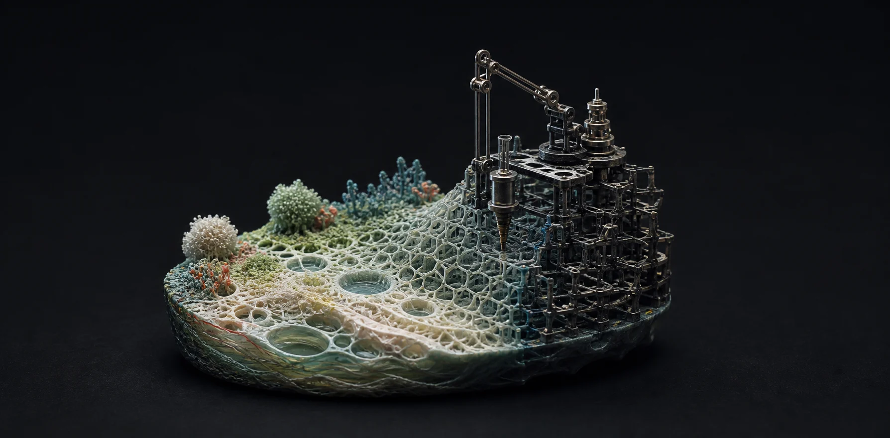

```{=html}
<figure class="worlds-visual">
  
</figure>

<div class="blog-intro">
  <p>Exploring living systems, computational systems, and things we build.</p>
  <nav class="blog-actions" aria-label="Blog and social links">
    <a href="blog.xml"><i class="bi bi-rss" aria-hidden="true"></i> RSS</a>
    <a href="https://www.linkedin.com/in/arashbagherabadi"><i class="bi bi-linkedin" aria-hidden="true"></i> LinkedIn</a>
    <a href="https://x.com/arash_b_abadi"><i class="bi bi-twitter-x" aria-hidden="true"></i> X</a>
    <a href="https://arashabadi.github.io/patoq/"><i class="bi bi-book" aria-hidden="true"></i> PATOQ Book</a>
  </nav>
</div>
```
