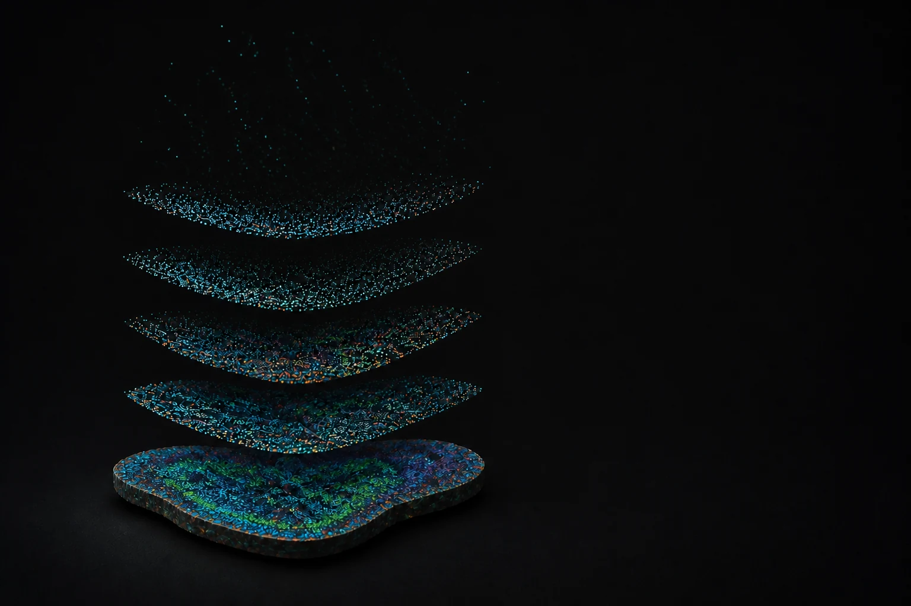

```{=html}
<div class="home-shell">
  <section class="hero" aria-labelledby="hero-title">
    <div class="hero-visual" aria-hidden="true">
      
    </div>

    <div class="hero-copy">
      <h1 id="hero-title">Arash<br>Bagherabadi <span class="alternate-name">(Arash B. Abadi)</span></h1>
      <p class="hero-umbrella">Small Worlds, Large Systems</p>
      <p class="hero-fields">Spatial Biology <span aria-hidden="true">·</span> Immunology <span aria-hidden="true">·</span> Computation</p>
      <a class="primary-action no-external" href="connect.html" target="_self">
        <span>Connect</span>
        <i class="bi bi-arrow-right" aria-hidden="true"></i>
      </a>
    </div>

    <a class="scroll-cue no-external" href="#about" target="_self" aria-label="Continue to About">
      <i class="bi bi-arrow-down" aria-hidden="true"></i>
    </a>
  </section>

  <section class="about-band" id="about" aria-labelledby="about-title">
    <div class="section-inner about-layout">
      <figure class="portrait-frame">
        
      </figure>

      <div class="about-copy">
        <p class="eyebrow">About</p>
        <h2 id="about-title">Exploring living systems, computational systems, and things we build.</h2>
        <p>I am a PhD student at the University of Alabama at Birmingham focused on immune biology and computational approaches in basic research. My work spans resident memory B cell biology and tertiary lymphoid structures (iBALT) in influenza infection, as well as regulatory T cell metabolism in cancer and obesity contexts, with growing emphasis on single-cell and spatial techniques (e.g., Xenium), reproducible bioinformatics workflows, machine learning, and agentic AI. I am especially interested in applying these tools to vaccine and immunotherapy research.</p>
        <p class="about-scope">That wider practice also makes room for scientific papers, mathematics, robotics, miniature art, education, and hands-on experiments drawn from everyday life.</p>
        <div class="about-links" aria-label="Explore Arash's work">
          <a class="no-external" href="#practice" target="_self">What I do <i class="bi bi-arrow-down" aria-hidden="true"></i></a>
          <a class="no-external" href="#projects" target="_self">Projects <i class="bi bi-arrow-down" aria-hidden="true"></i></a>
          <a class="no-external" href="#publications" target="_self">Publications <i class="bi bi-arrow-down" aria-hidden="true"></i></a>
        </div>
      </div>
    </div>
  </section>

  <section class="practice-band" id="practice" aria-labelledby="practice-title">
    <div class="section-inner">
      <div class="section-heading-row practice-heading">
        <div>
          <p class="eyebrow">What I do</p>
          <h2 id="practice-title">Work across three connected scales.</h2>
        </div>
        <p>Research, computation, and making are different ways of asking how complex systems work.</p>
      </div>

      <div class="practice-grid">
        <article class="practice-item">
          <span>01</span>
          <h3>Study living systems</h3>
          <p>Immune biology through spatial and single-cell approaches, with current work spanning resident memory B cells, iBALT, influenza, and regulatory T cell metabolism.</p>
        </article>
        <article class="practice-item">
          <span>02</span>
          <h3>Compute and interpret</h3>
          <p>Reproducible bioinformatics, scientific literature, machine learning, and agentic AI used to turn complex biological data into testable ideas.</p>
        </article>
        <article class="practice-item">
          <span>03</span>
          <h3>Build and teach</h3>
          <p>Laboratory robotics, 3D printing, miniature making, and educational resources that make technical ideas more tangible and accessible.</p>
        </article>
      </div>
    </div>
  </section>

  <section class="projects-band" id="projects" aria-labelledby="projects-title">
    <div class="section-inner">
      <div class="section-heading-row projects-heading">
        <div>
          <p class="eyebrow">Projects</p>
          <h2 id="projects-title">Ideas made tangible.</h2>
          <p class="projects-intro">A growing home for lab hardware, apps, interactive education, books, and open experiments.</p>
        </div>
        <a class="quiet-action no-external" href="projects.html" target="_self">Project archive <i class="bi bi-arrow-right" aria-hidden="true"></i></a>
      </div>

      <div class="project-list">
        <article class="project-row">
          <p class="project-kind">Robotics</p>
          <div>
            <h3>ELISPOT Plate Reader Robot</h3>
            <p>A 3D-printed plate reader in development for ELISPOT assays, paired with a vision language model counter and planned as a future open-source release.</p>
          </div>
          <span class="project-status">In progress</span>
        </article>
        <article class="project-row">
          <p class="project-kind">Education</p>
          <div>
            <h3>PATOQ Book</h3>
            <p>A Quarto-based learning resource that curates practical material across bioinformatics, data science, and machine learning.</p>
          </div>
          <a class="project-link" href="https://arashabadi.github.io/patoq/">Open book <i class="bi bi-arrow-up-right" aria-hidden="true"></i></a>
        </article>
        <article class="project-row">
          <p class="project-kind">Hackathon</p>
          <div>
            <h3>CM4AI CodeFest 2025</h3>
            <p>An alternative image-embedding workflow for immunofluorescence data using cell segmentation, preprocessing, and SubCell-based inference.</p>
          </div>
          <a class="project-link" href="https://github.com/arashabadi/cm4ai_codefest2025">Repository <i class="bi bi-arrow-up-right" aria-hidden="true"></i></a>
        </article>
      </div>
    </div>
  </section>

  <section class="publications-band" id="publications" aria-labelledby="publications-title">
    <div class="section-inner">
      <div class="section-heading-row publications-heading">
        <div>
          <p class="eyebrow">Publications</p>
          <h2 id="publications-title">Selected work.</h2>
        </div>
        <a class="primary-action" href="publications.html" target="_blank" rel="noopener">View all publications <i class="bi bi-arrow-up-right" aria-hidden="true"></i></a>
      </div>

      <div class="publication-list">
        <article class="publication-row">
          <div>
            <p class="publication-meta">Clinical Epigenetics <span aria-hidden="true">·</span> 2025</p>
            <h3>DNA methylation and machine learning: challenges and perspective toward enhanced clinical diagnostics</h3>
          </div>
          <a href="https://link.springer.com/article/10.1186/s13148-025-01967-0" aria-label="Open publication in Clinical Epigenetics"><i class="bi bi-arrow-up-right" aria-hidden="true"></i></a>
        </article>
        <article class="publication-row">
          <div>
            <p class="publication-meta">Genes <span aria-hidden="true">·</span> 2023</p>
            <h3>CCND1 Overexpression in Idiopathic Dilated Cardiomyopathy: A Promising Biomarker?</h3>
          </div>
          <a href="https://www.mdpi.com/2073-4425/14/6/1243" aria-label="Open publication in Genes"><i class="bi bi-arrow-up-right" aria-hidden="true"></i></a>
        </article>
      </div>
    </div>
  </section>

  <section class="connect-band connect-compact" id="connect" aria-labelledby="connect-title">
    <div class="section-inner connect-layout">
      <div class="connect-copy">
        <p class="eyebrow">Connect</p>
        <h2 id="connect-title">Contact, profiles, and a digital card.</h2>
        <a class="dark-action no-external" href="connect.html" target="_self">
          <span>Open contact card</span>
          <i class="bi bi-arrow-right" aria-hidden="true"></i>
        </a>
      </div>

      <a class="qr-tool no-external" href="connect.html" target="_self" aria-label="Open Arash Bagherabadi's digital contact card">
        <div class="qr-frame">
          
        </div>
      </a>
    </div>
  </section>
</div>
```
