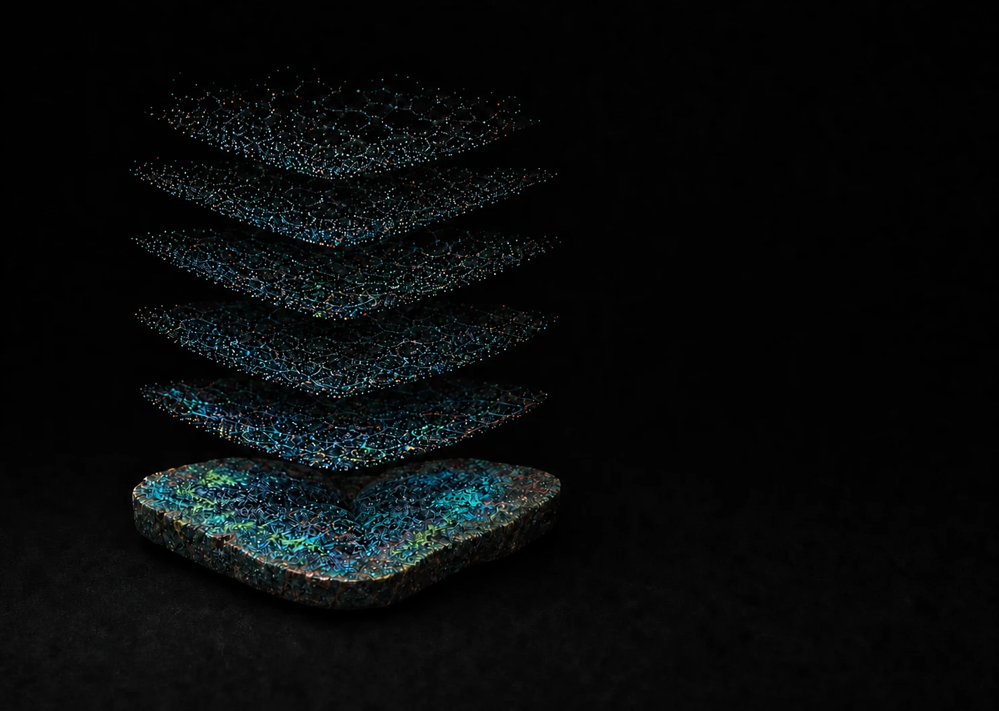

```{=html}
<script type="application/ld+json">
{
  "@context": "https://schema.org",
  "@type": "ProfilePage",
  "@id": "https://arashabadi.github.io/#profile-page",
  "url": "https://arashabadi.github.io/",
  "name": "Arash Bagherabadi (Arash B. Abadi)",
  "description": "Spatial biology, computational immunology, scientific machine learning, laboratory robotics, and educational making.",
  "inLanguage": "en",
  "dateModified": "2026-08-10",
  "isPartOf": { "@id": "https://arashabadi.github.io/#website" },
  "mainEntity": { "@id": "https://arashabadi.github.io/#person" },
  "primaryImageOfPage": {
    "@type": "ImageObject",
    "url": "https://arashabadi.github.io/images/hero-spatial-girih.webp"
  }
}
</script>

<div class="home-shell">
  <section class="hero" aria-labelledby="hero-title">
    <div class="hero-visual" aria-hidden="true">
      
      <div class="hero-cell-stage" data-hero-cells></div>
    </div>

    <div class="hero-copy">
      <h1 id="hero-title">Arash<br>Bagherabadi <span class="alternate-name">(Arash B. Abadi)</span></h1>
      <div class="hero-actions">
        <a class="primary-action no-external" href="connect.html" target="_self">
          <span>Connect</span>
          <i class="bi bi-arrow-right" aria-hidden="true"></i>
        </a>
        <a class="primary-action hero-github-action" href="https://github.com/arashabadi" rel="me noopener">
          <span>GitHub</span>
          <i class="bi bi-github" aria-hidden="true"></i>
        </a>
      </div>
    </div>

    <a class="scroll-cue no-external" href="#about" target="_self" aria-label="Continue to About">
      <i class="bi bi-arrow-down" aria-hidden="true"></i>
    </a>
  </section>

  <section class="about-band" id="about" aria-labelledby="about-title">
    <div class="section-inner about-layout">
      <figure class="portrait-frame">
        
      </figure>

      <div class="about-copy">
        <h2 id="about-title">Small Worlds, Large Systems</h2>
        <p class="about-intro">I am a PhD student at UAB studying immune biology with spatial and computational methods, especially where the work can inform vaccines and immunotherapy.</p>
        <p class="about-fields">Spatial Biology <span aria-hidden="true">·</span> Immunology <span aria-hidden="true">·</span> Computation</p>
      </div>
    </div>
  </section>

  <section class="practice-band" id="practice" aria-labelledby="practice-title">
    <div class="section-inner">
      <div class="section-heading-row practice-heading">
        <div>
          <p class="eyebrow">What I do</p>
          <h2 id="practice-title">I study, compute, build, and explore.</h2>
        </div>
      </div>

      <div class="practice-grid">
        <article class="practice-item">
          <span>01</span>
          <h3>Study immune systems</h3>
          <p>Resident-memory B cells and iBALT in influenza, plus regulatory T-cell metabolism in cancer and obesity.</p>
        </article>
        <article class="practice-item">
          <span>02</span>
          <h3>Compute across scales</h3>
          <p>Single-cell and spatial biology, including Xenium, supported by reproducible bioinformatics, machine learning, and agentic AI.</p>
        </article>
        <article class="practice-item">
          <span>03</span>
          <h3>Build and communicate</h3>
          <p>Lab robotics, 3D printing, educational tools, scientific writing, and visual design.</p>
        </article>
        <article class="practice-item">
          <span>04</span>
          <h3>Life beyond the lab</h3>
          <p>Running, time in nature, pickleball, miniature art, mathematics, and hands-on experiments.</p>
        </article>
      </div>
    </div>
  </section>

  <section class="publications-band" id="publications" aria-labelledby="publications-title">
    <div class="section-inner">
      <div class="section-heading-row publications-heading">
        <div>
          <p class="eyebrow">Publications</p>
          <h2 id="publications-title">Selected work.</h2>
        </div>
        <a class="primary-action" href="publications.html" target="_blank" rel="noopener">View all publications <i class="bi bi-arrow-up-right" aria-hidden="true"></i></a>
      </div>

      <div class="publication-list">
        <article class="publication-row">
          <div>
            <p class="publication-meta">Clinical Epigenetics <span aria-hidden="true">·</span> 2025</p>
            <h3>DNA methylation and machine learning: challenges and perspective toward enhanced clinical diagnostics</h3>
          </div>
          <a href="https://link.springer.com/article/10.1186/s13148-025-01967-0" aria-label="Open publication in Clinical Epigenetics"><i class="bi bi-arrow-up-right" aria-hidden="true"></i></a>
        </article>
        <article class="publication-row">
          <div>
            <p class="publication-meta">Genes <span aria-hidden="true">·</span> 2022</p>
            <h3>Correlation of NTRK1 Downregulation with Low Levels of Tumor-Infiltrating Immune Cells and Poor Prognosis of Prostate Cancer Revealed by Gene Network Analysis</h3>
          </div>
          <a href="https://www.mdpi.com/2073-4425/13/5/840" aria-label="Open NTRK1 publication in Genes"><i class="bi bi-arrow-up-right" aria-hidden="true"></i></a>
        </article>
      </div>
    </div>
  </section>

  <section class="projects-band" id="projects" aria-labelledby="projects-title">
    <div class="section-inner">
      <div class="section-heading-row projects-heading">
        <div>
          <p class="eyebrow">Selected projects</p>
          <h2 id="projects-title">Ideas made tangible.</h2>
        </div>
        <a class="primary-action no-external" href="projects.html" target="_self">View all projects <i class="bi bi-arrow-right" aria-hidden="true"></i></a>
      </div>

      <div class="project-list">
        <article class="project-row">
          <p class="project-kind">Education</p>
          <div class="project-copy">
            <h3>PATOQ Book</h3>
            <p>A Quarto-based learning resource that curates practical material across bioinformatics, data science, and machine learning.</p>
          </div>
          <a class="project-link" href="https://arashabadi.github.io/patoq/">Open book <i class="bi bi-arrow-up-right" aria-hidden="true"></i></a>
        </article>
        <article class="project-row">
          <p class="project-kind">Hackathon</p>
          <div class="project-copy">
            <h3>CM4AI CodeFest 2025</h3>
            <p>An alternative image-embedding workflow for immunofluorescence data using cell segmentation, preprocessing, and SubCell-based inference.</p>
          </div>
          <a class="project-link" href="https://github.com/arashabadi/cm4ai_codefest2025">Repository <i class="bi bi-arrow-up-right" aria-hidden="true"></i></a>
        </article>
      </div>
    </div>
  </section>

  <section class="connect-band connect-compact" id="connect" aria-labelledby="connect-title">
    <div class="section-inner connect-layout">
      <div class="connect-copy">
        <p class="eyebrow">Connect</p>
        <h2 id="connect-title">Contact, profiles, and a digital card.</h2>
        <a class="dark-action no-external" href="connect.html" target="_self">
          <span>Open contact card</span>
          <i class="bi bi-arrow-right" aria-hidden="true"></i>
        </a>
      </div>

      <a class="qr-tool no-external" href="connect.html" target="_self" aria-label="Open Arash Bagherabadi's digital contact card">
        <div class="qr-frame">
          
        </div>
      </a>
    </div>
  </section>
</div>
```
