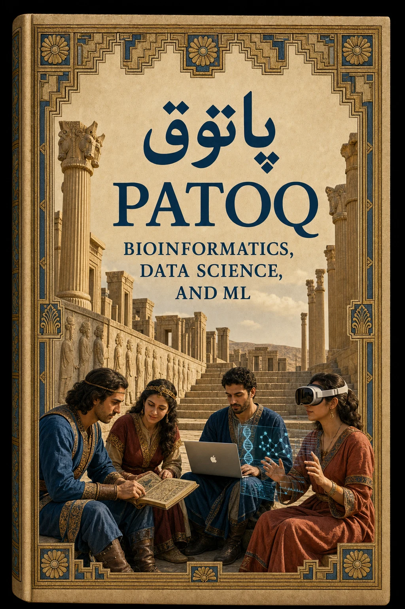
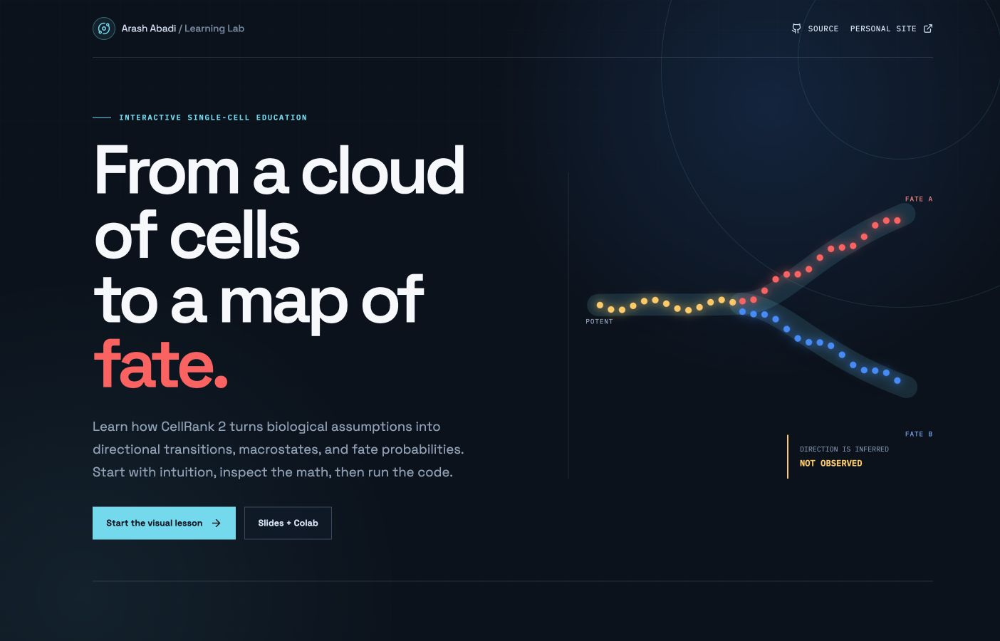
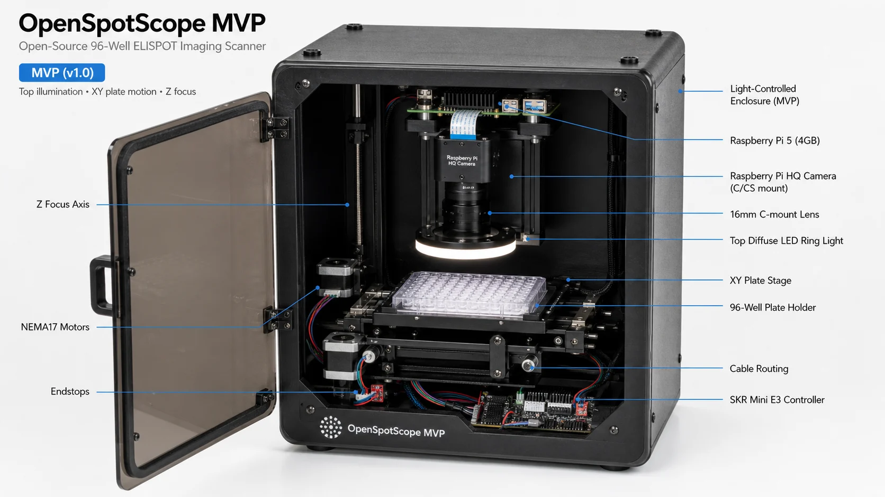

::: {.content}

::: {.archive-intro}
This is the durable home for things I build: research tools, laboratory hardware, apps, interactive educational work, books, and open experiments. As a project grows, its page can hold the full design, development history, documentation, and releases; related blog posts can tell the smaller stories along the way.
:::

## Educational Resources {.section-heading}

::: {.card .project-card}
::: {.project-card-media .project-card-media-contain}
{fig-alt="PATOQ book cover combining Persian heritage with bioinformatics and machine learning" loading="lazy" decoding="async"}
:::
::: {.project-card-copy}
### PATOQ Book

A comprehensive Quarto-based online HTML book for the PATOQ project, providing curated resources for learning Bioinformatics, Data Science, and Machine Learning.

[View Project →](https://arashabadi.github.io/patoq/)
:::
:::

## Apps {.section-heading}

::: {.card .project-card}
::: {.project-card-media}
{fig-alt="CellRank 2 Learning Lab interactive trajectory explorer" loading="lazy" decoding="async"}
:::
::: {.project-card-copy}
### CellRank 2 Learning Lab

An interactive educational app for learning how CellRank 2 turns neighborhood graphs into directional transitions, macrostates, and fate probabilities. The lab combines a high-contrast 3D explorer, kernel intuition and formulas, Python input maps, slides, papers, notes, and runnable notebooks.

[Launch App →](https://arashabadi.github.io/cellrank2-learning-lab/)

[View Repository →](https://github.com/arashabadi/cellrank2-learning-lab)
:::
:::

## Hackathons {.section-heading}

::: {.card .project-card}
::: {.project-card-media .project-card-media-contain}
{fig-alt="Embedding Mafia graphic for the CM4AI CodeFest 2025 project" loading="lazy" decoding="async"}
:::
::: {.project-card-copy}
### CM4AI CodeFest 2025

Team project from the 2025 CM4AI Hackathon at UAB focused on alternative image-embedding workflows for immunofluorescence data. The work explored cell segmentation, per-cell cropping and preprocessing, and SubCell-based inference to generate embeddings, attention maps, and class probabilities for downstream comparison with the CM4AI pipeline.

[View Repository →](https://github.com/arashabadi/cm4ai_codefest2025)
:::
:::

## Robotics {.section-heading}

::: {.card .project-card}
::: {.project-card-media}
{fig-alt="OpenSpotScope ELISPOT plate reader with annotated hardware components" loading="lazy" decoding="async"}
:::
::: {.project-card-copy}
### ELISPOT Plate Reader Robot

An ongoing personal project developing a 3D-printed plate reader for ELISPOT assays with a vision language model (VLM) counter. The project is planned to be published open source and made available online in the future.

**Status:** In progress 
**Availability:** Private now; planned open source release
:::
:::

:::
