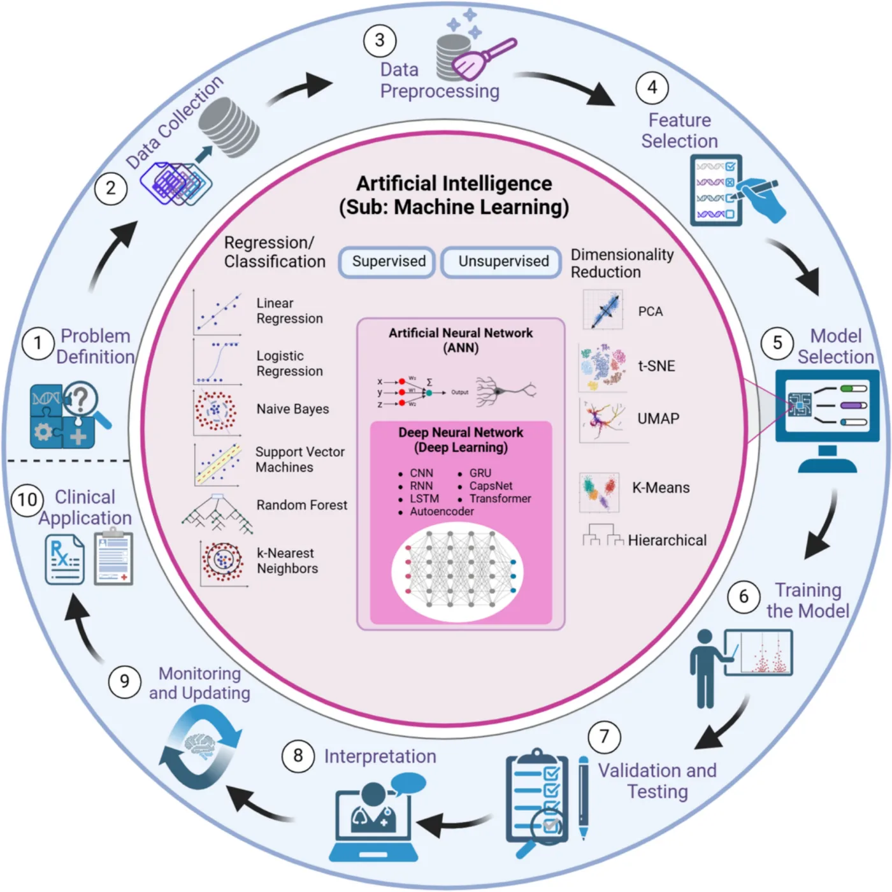
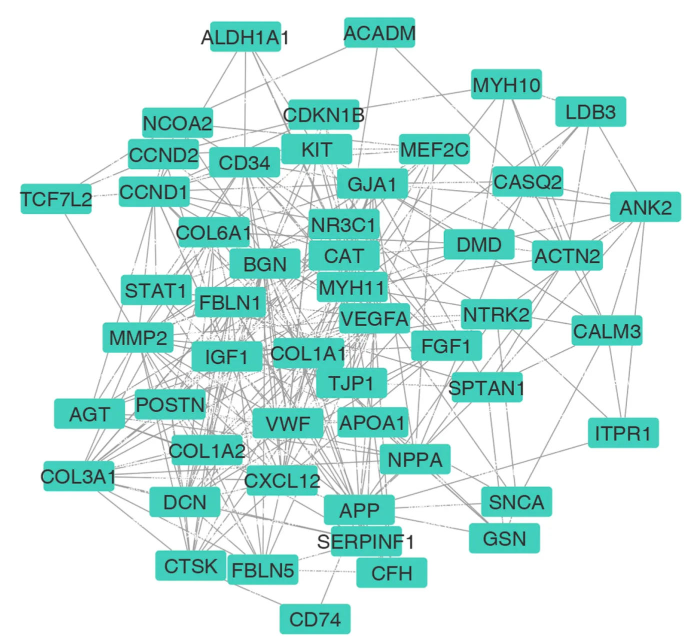
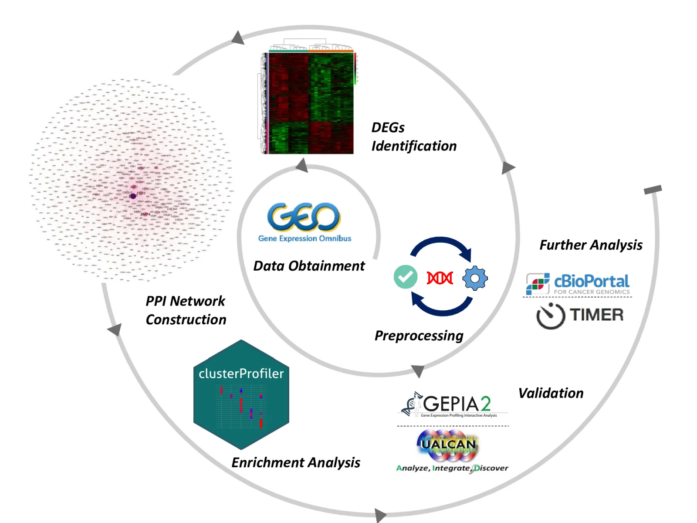
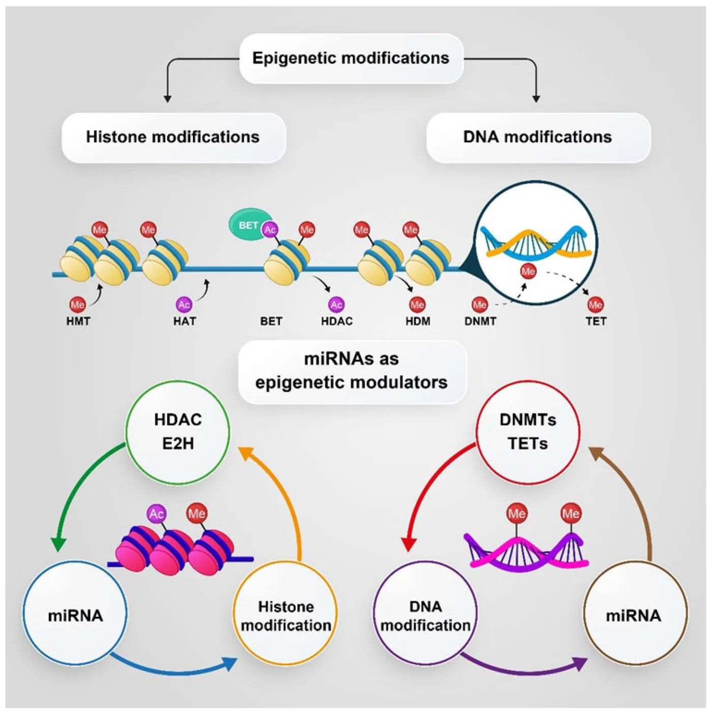

```{=html}
<script type="application/ld+json">
{
  "@context": "https://schema.org",
  "@type": "ItemList",
  "name": "Publications by Arash Bagherabadi",
  "itemListElement": [
    {
      "@type": "ListItem",
      "position": 1,
      "item": {
        "@type": "ScholarlyArticle",
        "headline": "DNA methylation and machine learning: challenges and perspective toward enhanced clinical diagnostics",
        "datePublished": "2025-10-10",
        "url": "https://doi.org/10.1186/s13148-025-01967-0",
        "image": "https://arashabadi.github.io/images/publication-dna-methylation-ml.webp",
        "license": "https://creativecommons.org/licenses/by-nc-nd/4.0/",
        "author": { "@id": "https://arashabadi.github.io/#person" },
        "isPartOf": { "@type": "Periodical", "name": "Clinical Epigenetics" }
      }
    },
    {
      "@type": "ListItem",
      "position": 2,
      "item": {
        "@type": "ScholarlyArticle",
        "headline": "CCND1 Overexpression in Idiopathic Dilated Cardiomyopathy: A Promising Biomarker?",
        "datePublished": "2023-06-10",
        "url": "https://doi.org/10.3390/genes14061243",
        "image": "https://arashabadi.github.io/images/publication-ccnd1-idcm.webp",
        "license": "https://creativecommons.org/licenses/by/4.0/",
        "author": { "@id": "https://arashabadi.github.io/#person" },
        "isPartOf": { "@type": "Periodical", "name": "Genes" }
      }
    },
    {
      "@type": "ListItem",
      "position": 3,
      "item": {
        "@type": "ScholarlyArticle",
        "headline": "Correlation of NTRK1 Downregulation with Low Levels of Tumor-Infiltrating Immune Cells and Poor Prognosis of Prostate Cancer Revealed by Gene Network Analysis",
        "datePublished": "2022-05-08",
        "url": "https://doi.org/10.3390/genes13050840",
        "image": "https://arashabadi.github.io/images/publication-ntrk1-prostate.webp",
        "license": "https://creativecommons.org/licenses/by/4.0/",
        "author": { "@id": "https://arashabadi.github.io/#person" },
        "isPartOf": { "@type": "Periodical", "name": "Genes" }
      }
    },
    {
      "@type": "ListItem",
      "position": 4,
      "item": {
        "@type": "ScholarlyArticle",
        "headline": "Targeting Protein Kinases and Epigenetic Control as Combinatorial Therapy Options for Advanced Prostate Cancer Treatment",
        "datePublished": "2022-02-25",
        "url": "https://doi.org/10.3390/pharmaceutics14030515",
        "image": "https://arashabadi.github.io/images/publication-kinase-epigenetic.webp",
        "license": "https://creativecommons.org/licenses/by/4.0/",
        "author": { "@id": "https://arashabadi.github.io/#person" },
        "isPartOf": { "@type": "Periodical", "name": "Pharmaceutics" }
      }
    }
  ]
}
</script>

<div class="publication-archive">
  <article class="publication-feature">
    <figure class="publication-figure">
      
    </figure>
    <div class="publication-feature-copy">
      <p class="publication-meta">Clinical Epigenetics <span aria-hidden="true">·</span> 2025</p>
      <h2>DNA methylation and machine learning: challenges and perspective toward enhanced clinical diagnostics</h2>
      <p class="publication-summary">A review of DNA methylation technologies and machine-learning workflows for clinical diagnostics, including model development, interpretability, validation, and emerging agentic approaches.</p>
      <a class="publication-open" href="https://link.springer.com/article/10.1186/s13148-025-01967-0">Read publication <i class="bi bi-arrow-up-right" aria-hidden="true"></i></a>
      <p class="publication-credit">Unmodified Figure 3. Open-access article licensed CC BY-NC-ND 4.0.</p>
    </div>
  </article>

  <article class="publication-feature">
    <figure class="publication-figure">
      
    </figure>
    <div class="publication-feature-copy">
      <p class="publication-meta">Genes <span aria-hidden="true">·</span> 2023</p>
      <h2>CCND1 Overexpression in Idiopathic Dilated Cardiomyopathy: A Promising Biomarker?</h2>
      <p class="publication-summary">A network-analysis and experimental-validation study investigating hub genes in idiopathic dilated cardiomyopathy and the potential of CCND1 as a biomarker.</p>
      <a class="publication-open" href="https://www.mdpi.com/2073-4425/14/6/1243">Read publication <i class="bi bi-arrow-up-right" aria-hidden="true"></i></a>
      <p class="publication-credit">Figure 3 reproduced from the open-access article under CC BY 4.0.</p>
    </div>
  </article>

  <article class="publication-feature">
    <figure class="publication-figure publication-figure-wide">
      
    </figure>
    <div class="publication-feature-copy">
      <p class="publication-meta">Genes <span aria-hidden="true">·</span> 2022</p>
      <h2>Correlation of NTRK1 Downregulation with Low Levels of Tumor-Infiltrating Immune Cells and Poor Prognosis of Prostate Cancer Revealed by Gene Network Analysis</h2>
      <p class="publication-summary">A bioinformatics study connecting NTRK1 downregulation with prostate cancer prognosis, tumor mutational burden, and reduced infiltration by immune populations including CD8+ T cells.</p>
      <a class="publication-open" href="https://www.mdpi.com/2073-4425/13/5/840">Read publication <i class="bi bi-arrow-up-right" aria-hidden="true"></i></a>
      <p class="publication-credit">Graphical abstract from the open-access article licensed CC BY 4.0.</p>
    </div>
  </article>

  <article class="publication-feature">
    <figure class="publication-figure">
      
    </figure>
    <div class="publication-feature-copy">
      <p class="publication-meta">Pharmaceutics <span aria-hidden="true">·</span> 2022</p>
      <h2>Targeting Protein Kinases and Epigenetic Control as Combinatorial Therapy Options for Advanced Prostate Cancer Treatment</h2>
      <p class="publication-summary">A review of protein-kinase signaling and epigenetic dysregulation in advanced prostate cancer, with emphasis on their potential as combined therapeutic targets.</p>
      <a class="publication-open" href="https://www.mdpi.com/1999-4923/14/3/515">Read publication <i class="bi bi-arrow-up-right" aria-hidden="true"></i></a>
      <p class="publication-credit">Figure 3 reproduced from the open-access article under CC BY 4.0.</p>
    </div>
  </article>
</div>
```
